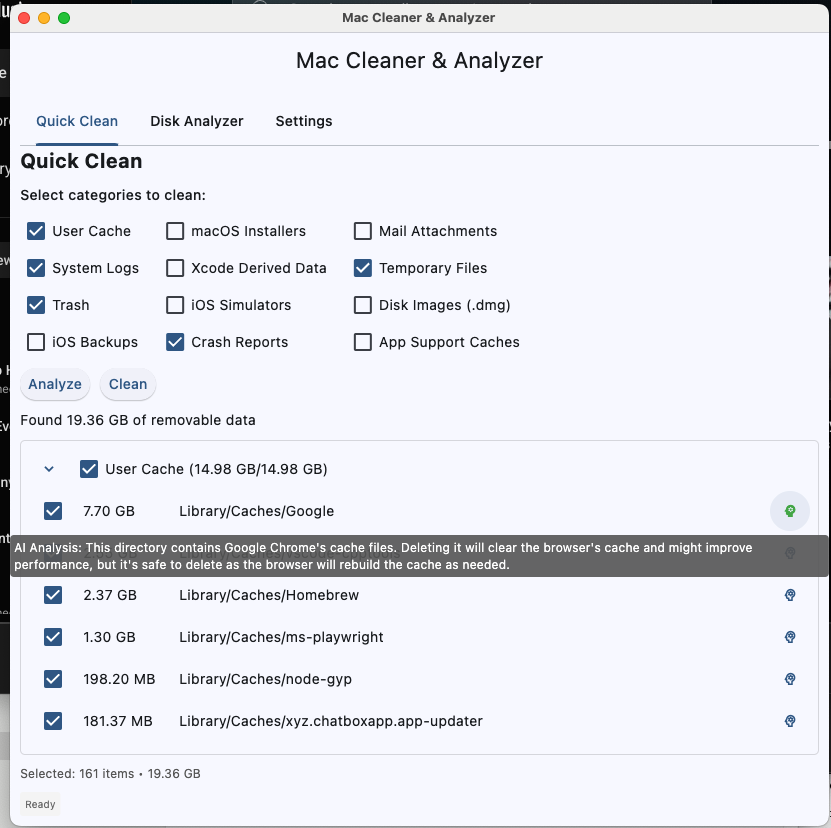
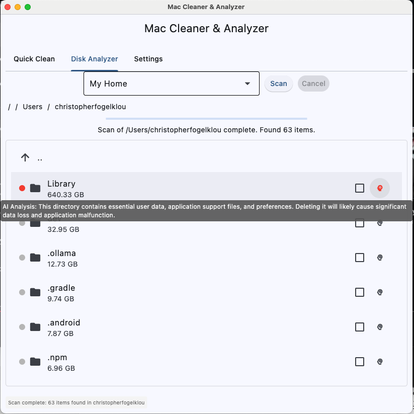
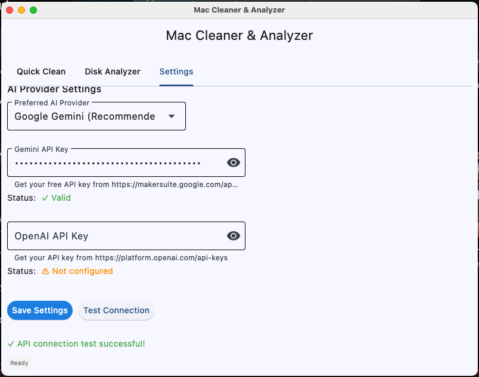

# Mac Cleaner & Analyzer with AI Advice

A powerful macOS utility application that provides two essential disk management features:

- **Quick Clean**: Remove common junk files with a simple checkbox interface. If you are unsure if something is safe to delete, ask AI!
- **Disk Analyzer**: Let's you scan/clean any directory on your macOS Machine.

## Screens

### Quick Clean Screen


### Disk Analyzer


### Settings Screen with AI Setup


## Features

### Quick Clean
- ✅ One-click analysis and cleanup of common junk files
- ✅ Selective cleaning with checkboxes for different file types:
  - User Cache files
  - System Logs
  - Trash contents
  - iOS and local system (macOS) backups
  - etc.
- ✅ Size calculation and preview of files to be deleted
- ✅ AI-powered analysis for unknown file types

### Disk Analyzer
- ✅ Multi-threaded directory scanning with progress indication
- ✅ Breadcrumb navigation for easy directory traversal
- ✅ Safety-coded file analysis with colored indicators:
  - 🟢 Green: Safe to delete
  - 🟠 Orange: Caution advised
  - 🔴 Red: Do not delete (system files)
  - ⚪ Grey: Unknown (AI analysis available)
- ✅ AI-powered analysis for unknown file types

## Safety Features

The application includes comprehensive safety measures to prevent accidental deletion of important files:

### Pre-defined Safety Rules

The app includes built-in knowledge of macOS file system structure:
- System directories (`/System`, `/usr`, `/bin`) are marked as **red** (unsafe)
- User data directories (`~/Documents`, `~/Pictures`) are marked as **orange** (caution)
- Cache and temporary files are marked as **green** (safe)
- And many more predefined rules...

### AI Analysis
For unknown files and directories, the application can perform AI analysis to provide intelligent safety recommendations and explanations. You need to provide your own OpenAI or Google Gemini API Keys.

## Installation

### Option 1: From Source (Recommended for Development)

#### Prerequisites
- Python 3.10 or later
- Git

#### Setup Instructions

1. **Clone the repository:**
   ```bash
   git clone https://github.com/your-username/mac-cleaner.git
   cd mac-cleaner
   ```

2. **Create and activate a virtual environment:**
   ```bash
   python3 -m venv venv
   source venv/bin/activate
   ```

3. **Install dependencies:**
   ```bash
   pip install -r requirements.txt
   ```

4. **Run the application:**
   ```bash
   python main.py
   ```
   
   Or use the virtual environment directly:
   ```bash
   venv/bin/python main.py
   ```

### Building .app from Source

To create a standalone application bundle:

1. **Make sure you're in the project directory with virtual environment activated:**
   ```bash
   source venv/bin/activate
   ```

2. **Run the build script:**
   ```bash
   chmod +x build.sh
   ./build.sh
   ```

3. **Find the built application:**
   The application will be created in `build/Mac Cleaner & Analyzer/Mac Cleaner & Analyzer.app`

### Granting Full Disk Access (macOS)

To allow the app to clean and analyze all files on your Mac, you may need to grant it Full Disk Access:

1. **Build and sign the app** (see build instructions above).
2. Open **System Settings** > **Privacy & Security** > **Full Disk Access**.
3. Click the **+** button and select the `.app` bundle from the `dist` directory (e.g., `dist/Mac Cleaner & Analyzer.app`).
   - Do **not** select the binary inside the app bundle.
4. Ensure the checkbox next to the app is enabled.
5. Restart the app if it was running.

If the app does not appear in the list, make sure it is signed (the build script does this automatically for development). For production/distribution, use a valid Developer ID certificate.

## Development

### Code Style
This project follows these coding standards:
- **Formatter**: Black (88 character line length)
- **Linter**: Flake8
- **Configuration**: Settings stored in `pyproject.toml`

### Running Code Quality Checks

```bash
# Format code with Black
black .

# Check formatting
black --check .

# Run linting
flake8 .
```

### Project Structure
```
mac-cleaner/
├── main.py                         # Main application entry point
├── requirements.txt                # Python dependencies
├── build.sh                        # Build script for creating .app bundle
├── pyproject.toml                  # Code formatting and linting configuration
├── .github/workflows/              # CI/CD pipeline
├── .github/copilot-instructions.md # AI Guidance & Context
├── GEMINI.md                       # AI Guidance & Context
└── README.md                       # This file
```

## Technology Stack

- **GUI Framework**: [Flet](https://flet.dev/) - Modern Python UI framework
- **AI Integration**: Google Gemini & OpenAI API for intelligent file analysis
- **Build Tool**: PyInstaller for creating standalone applications
- **Multi-threading**: Concurrent file scanning with ThreadPoolExecutor
- **Target Platform**: macOS

## Contributing

1. Fork the repository
2. Create a feature branch (`git checkout -b feature/amazing-feature`)
3. Make your changes following the coding standards
4. Run tests and code quality checks
5. Commit your changes (`git commit -m 'Add amazing feature'`)
6. Push to the branch (`git push origin feature/amazing-feature`)
7. Open a Pull Request

### Development Guidelines

- Follow the specifications in `GEMINI.md`
- Maintain consistency with existing code style
- Add comments for complex logic
- Test your changes thoroughly
- Update documentation as needed

## License

This project is licensed under the MIT License - see the [LICENSE](LICENSE) file for details.

## Disclaimer

⚠️ **Important Safety Notice**: While this application includes comprehensive safety measures, always be cautious when deleting files. The AI analysis is for guidance only and should not be the sole basis for deletion decisions. Always verify before deleting important files, and ensure you have backups of critical data.

## Support

If you encounter any issues or have questions:
1. Fork the project and fix them yourself

**Made with ❤️ and AI for macOS users who want to keep their systems clean and organized.**
